# Experiments Website

## Overview

Here we present additional experiments that further confirm the performance of our proposed method, CMAB-SAMBA. 
Here we have experimetns with larger scale, as well as additional ablation studies. 

# Experiment 1: Regret Progression Over Rounds (K = 20, 50, 100)

We run our experiments for larger scale settings to confirm the scalability of our method.

## $K = 20, d = 5, C = 100k, \Delta = 10^{-2}$

<table>
  <tr>
    <td align="center">
      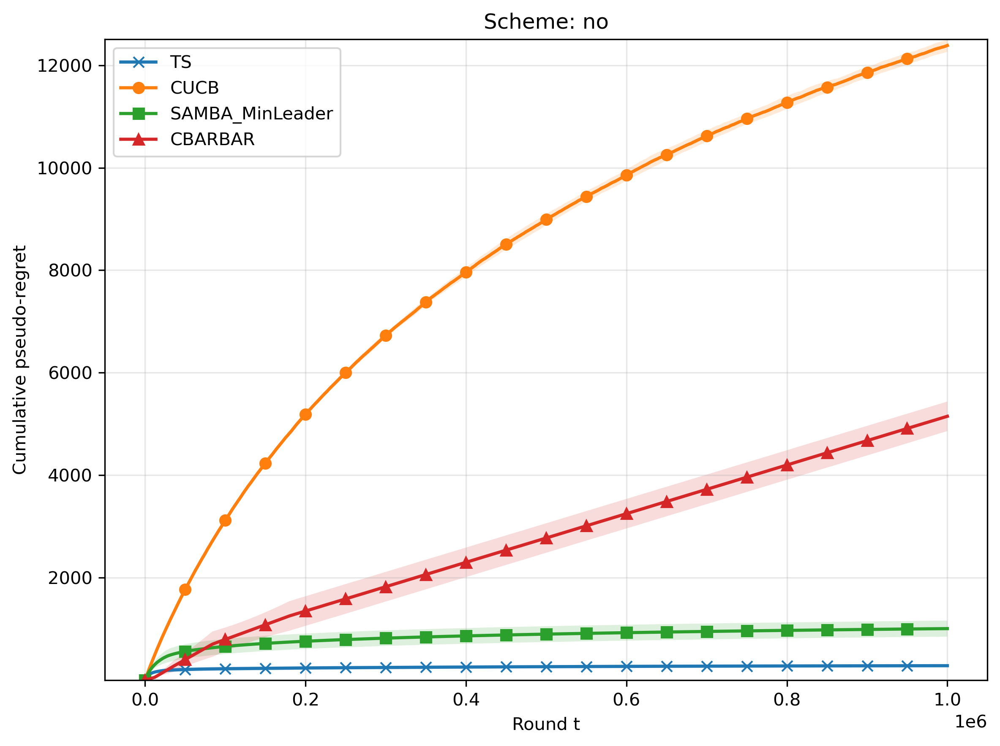 
      <b>(a)</b> No Corruption.
    </td>
     <td align="center">
       
      <b>(b)</b> Corruption in C random Rounds.
    </td>
    </tr>
  <tr>
    <td align="center">
      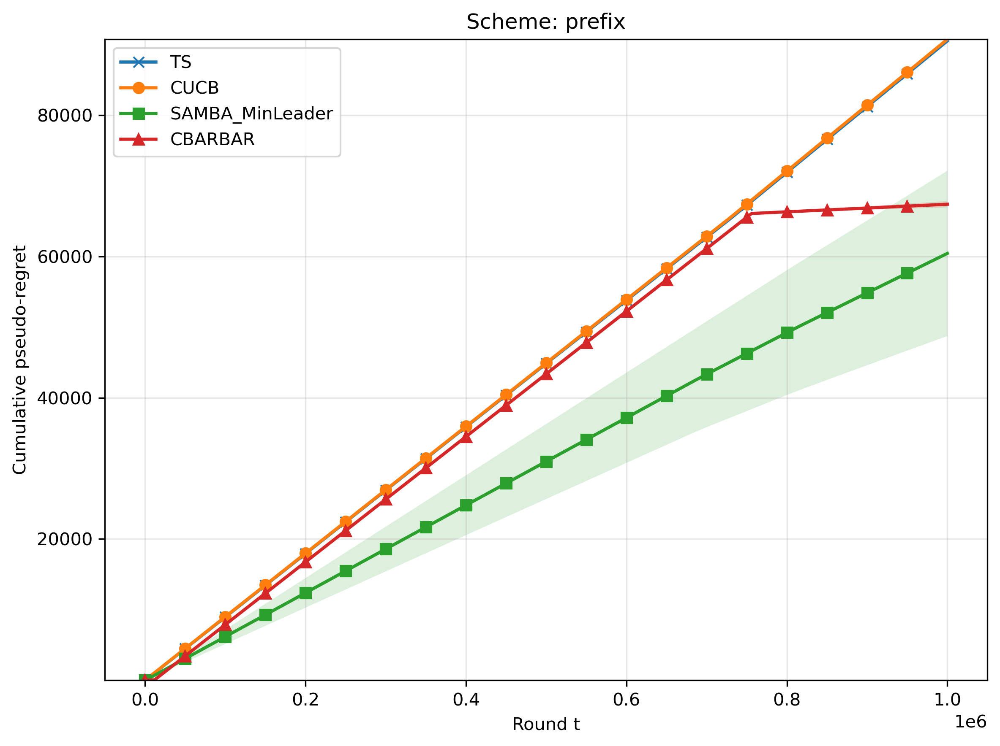 
      <b>(c)</b> First C Rounds Corrupted
    </td>
    <td align="center">
      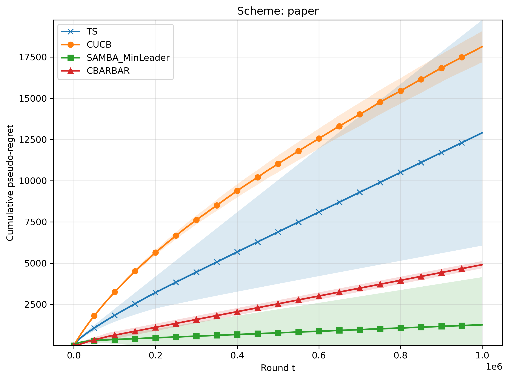 
      <b>(d)</b> Targeted Attack.
    </td>
  </tr>
</table>
 

  <b>Figure 1.</b> $K = 20, d = 5, C = 100k, \Delta = 10^{-2}$

## $K = 50, d = 5, C = 100k, \Delta = 10^{-2}$

<table>
  <tr>
    <td align="center">
      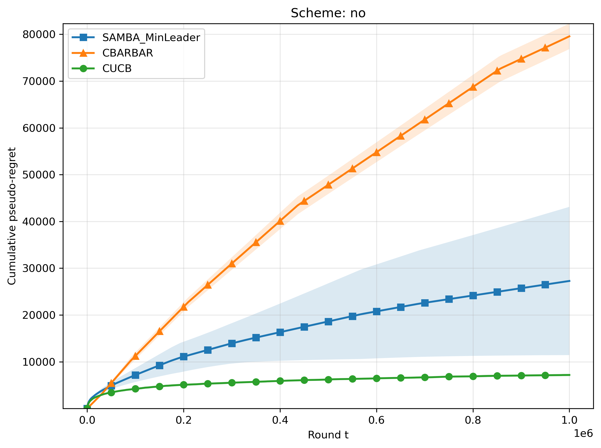 
      <b>(a)</b> No Corruption.
    </td>
     <td align="center">
      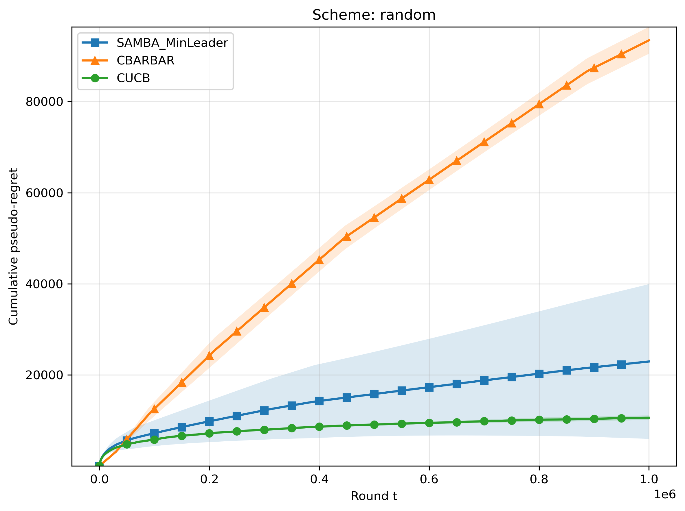 
      <b>(b)</b> Corruption in C random Rounds.
    </td>
    </tr>
  <tr>
    <td align="center">
      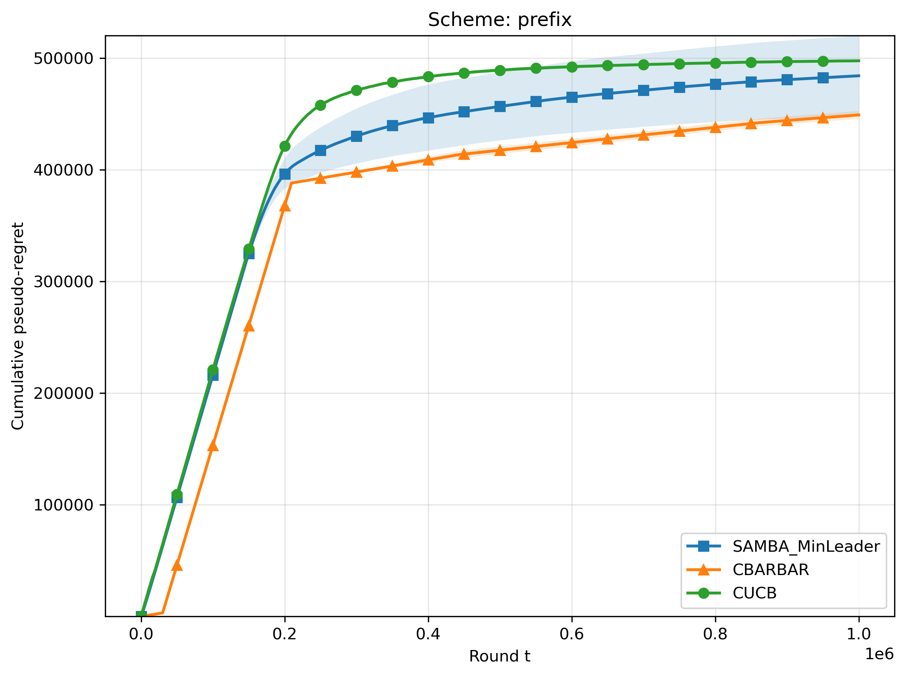 
      <b>(c)</b> First C Rounds Corrupted
    </td>
    <td align="center">
      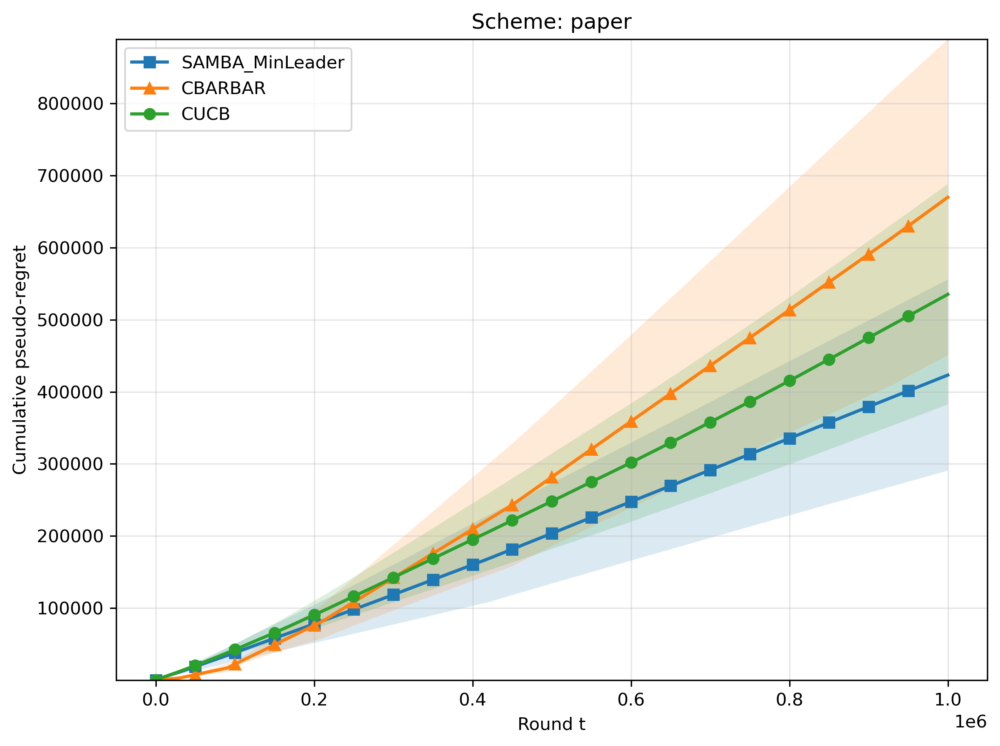 
      <b>(d)</b> Targeted Attack.
    </td>
  </tr>
</table>
 

  <b>Figure 1.</b> $K = 50, d = 5, C = 100k, \Delta = 10^{-2}$

## $K = 100, d = 5, C = 100k, \Delta = 10^{-2}$

<table>
  <tr>
    <td align="center">
      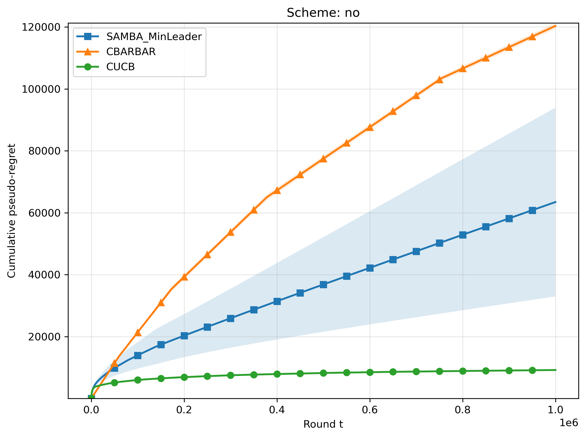 
      <b>(a)</b> No Corruption.
    </td>
     <td align="center">
      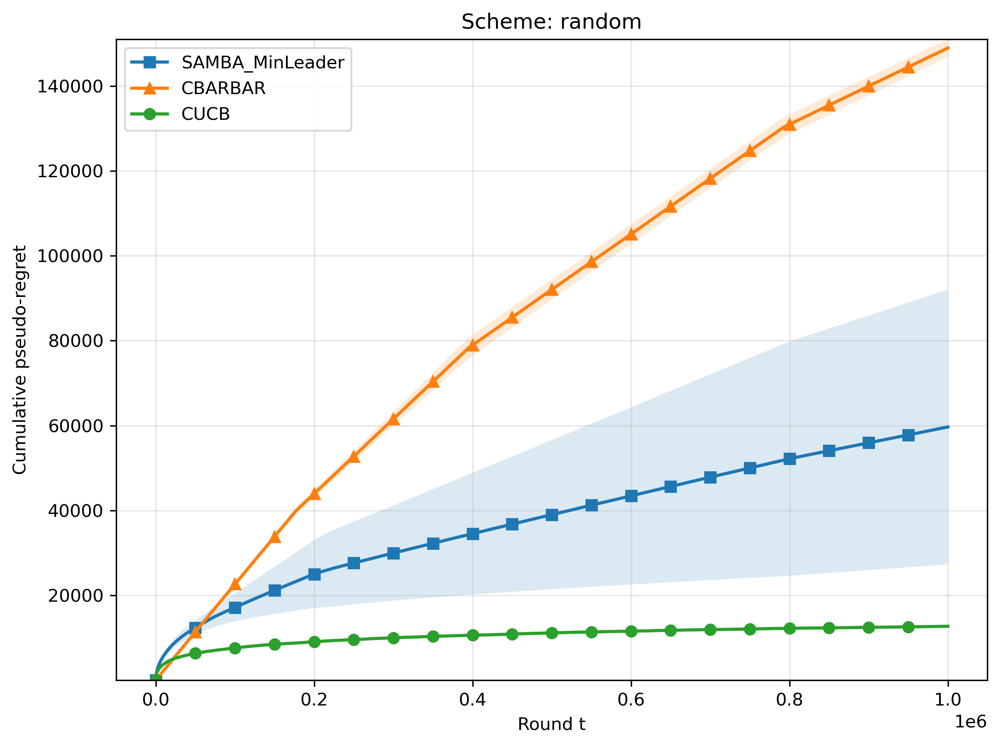 
      <b>(b)</b> Corruption in C random Rounds.
    </td>
    </tr>
  <tr>
    <td align="center">
      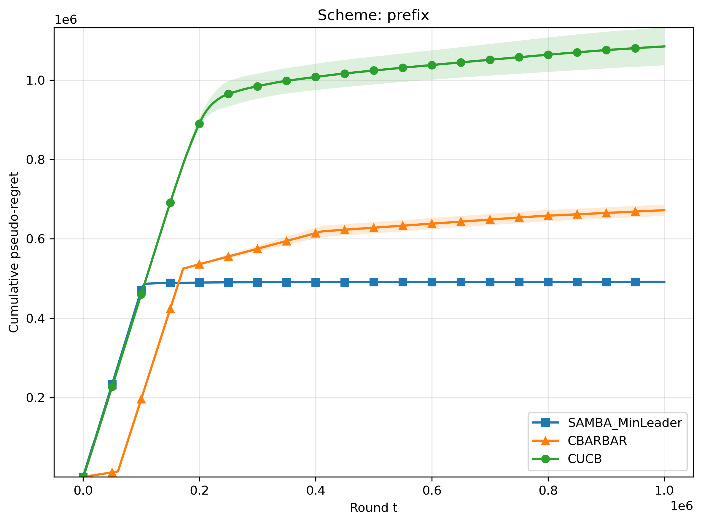 
      <b>(c)</b> First C Rounds Corrupted
    </td>
    <td align="center">
      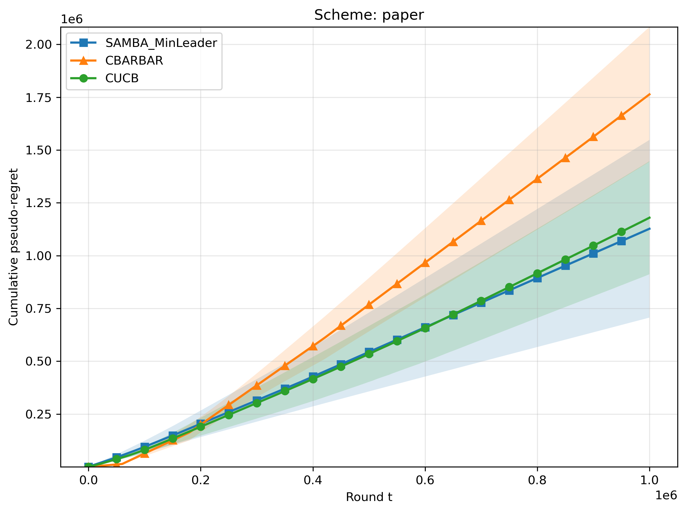 
      <b>(d)</b> Targeted Attack.
    </td>
  </tr>
</table>
 

  <b>Figure 1.</b> $K = 100, d = 5, C = 100k, \Delta = 10^{-2}$

## Notes

- All figures are stored in the `figures/` folder.
- Replace the sample captions with your experiment-specific descriptions.
- You can add more sections here for methods, data, or conclusions.
