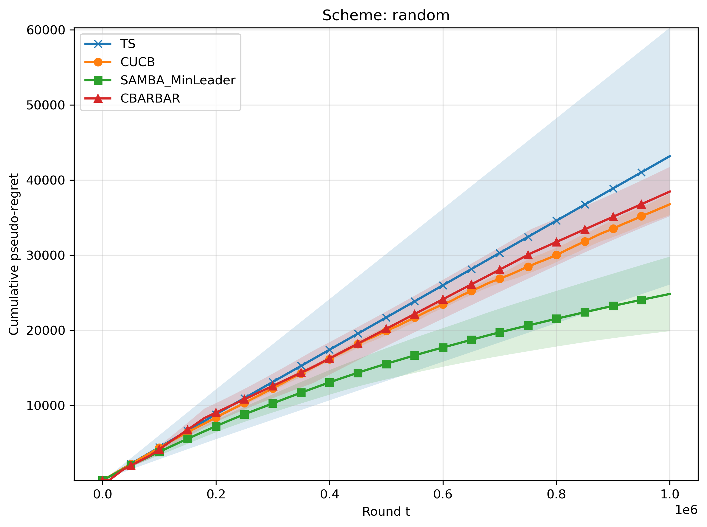

# Sample Experiment Website

## Overview

Here we present additional experiments that further confirm the performance of our proposed method, CMAB-SAMBA. 
Here we have experimetns with larger scale, as well as additional ablation studies. 

## Experiment Description

We ran a small exploratory experiment to evaluate model behavior under four settings. Each panel below shows one result example. Together, these figures highlight qualitative differences across conditions and provide a quick visual comparison.

## Results

<table>
  <tr>
    <td align="center">
       
      <b>(a)</b> Baseline result under Condition 1.
    </td>
    <td align="center">
       
      <b>(b)</b> Output observed for Condition 2.
    </td>
  </tr>
  <tr>
    <td align="center">
       
      <b>(c)</b> Representative result for Condition 3.
    </td>
    <td align="center">
       
      <b>(d)</b> Final example under Condition 4.
    </td>
  </tr>
</table>

  <b>Figure 1.</b> Qualitative comparison of four experiment conditions. Each panel shows a representative PNG output, with subcaptions describing the corresponding case.

## Notes

- All figures are stored in the `figures/` folder.
- Replace the sample captions with your experiment-specific descriptions.
- You can add more sections here for methods, data, or conclusions.
